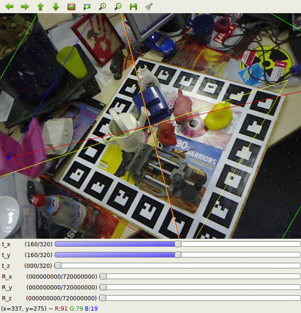

# 6D Annotator

This is a tool used to create 6D labels for 2D images. 6D labelling means that a 3D object is fitted onto it's projection in a 2D picture. It is 6D, because the 3D bounding box fitting requires 3 translational inputs (x,y,z) and 3 rotational degrees. It is designed to create labels for [singleshotpose](https://github.com/microsoft/singleshotpose) and [betapose](https://github.com/sjtuytc/betapose). But should be easily extendable to other 6D label formats.

### Features
The tool has the following features:
- Semi-automatic - left click with the mouse on 4 points of the bounding box and a PnP algorithm would create initial guess what the bounding box coordinates are
- Pick-up where you left off - the program looks how many labels are already created and continues from the last picture which was not yet labeled

### How to use
The program was tested on python 3.7.

1. First install all needed libraries.
2. Prepare a 3D model of the object you would like ot use in .ply format.
3. (optional) To use the PnP functionality choose 4 easy to find points that are visible on most images. Take their 3d coordinates from the ply model. Then substitute the `all_points = ...` array in `BoundingBox.py` with your points. To find out what the 3d coordinate of the points you've chosen are you can use Meshlab. Just open your ply model, choose the measuring tool, click 2 of the points and click 'P'. The coordinates of the 2 points would be displayed in the lower right console.
4. To start the program type in the following command:
```
python manualLabelCv.py -i <images dir> -m <PLY 3d-model of the object>
```
5. Contols are as follows:
- sliders under the the viewfinder - use the sliders to move and rotate the bounding box in the corresponding.
- `left mouse click` - selects one of the 8 points of the bounding box. Be careful with the points selection. Try to type them in the following order:
                  [[min_x, min_y, min_z],
                  [min_x, min_y, max_z],
                  [min_x, max_y, min_z],
                  [min_x, max_y, max_z],
                  [max_x, min_y, min_z],
                  [max_x, min_y, max_z],
                  [max_x, max_y, min_z],
                  [max_x, max_y, max_z]]
- `n` - next. After you are satisfied with the bouding box click `n` to create its labels and to go to the next image, if any.
- `c` - closes the program

### Demo

First the PnP functionality is used to create initial guess. Beaware that the order in which the corners are clicked is importaint. After the PnP initial guess the bounding box is manuall refined.


